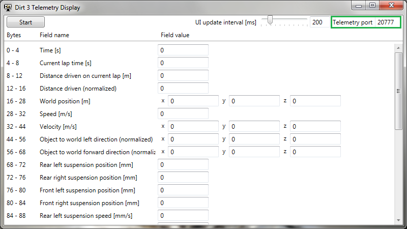

# Dirt3TelemetryDisplay
A display for variables sent by DiRT 3 telemetry feature which bases on UDP communication.

## Description
The main purpose of the program is to discover what variables the game can provide and show them 
changing during the gameplay. Information of each variable byte-offset of UDP packet which is sent 
by the game can be especially useful for DIY projects such as custom speed-o-meter or additional 
display with UI information from the game to keep the main screen clean.

Note that the names of the variables are guessed from various sources such as gameplay, telemetry 
documentation for newer DiRT games and so on, so they may not be 100% accurate as I could not find 
any official documentation of telemetry output for DiRT 3.

## Instruction

Show instruction steps

 * On application launch, the main window should look like this:

   

 * ``UI update interval`` slider can be used to adjust how often the variable fields will be 
 updated in milliseconds.

   

 * ``Telemetry port`` determines to which port the application will listen. The telemetry port 
 configuration of the game is specified in the [installation section](#installation).

   

 * Numeric ranges 
   * UI update interval: ``10-1000``
   * Telemetry port: ``0-65535``

 * Setting values out of range will be marked as shown in the screenshot below and during the 
 listening process the program will apply last correct values.

   

 * Other definitions:
   * ``Bytes``: Value of byte offset of each variable stored in the UDP data section.
   * ``Field name``: Name represented by each variable. 
   * ``Field value``: Value interpreted as 
   [32-bit float](https://en.wikipedia.org/wiki/Single-precision_floating-point_format) 
   or multiple float values that represent vector. 

   

 * To start the listening process, press ``Start`` button. 
 During listening the configuration variables cannot be modified and their fields will be disabled 
 until the ``Stop`` button is pressed.

   

## Screenshots

## Installation
Make sure to configure the ``hardware_settings_config.xml`` file which is necessary to receive the 
DiRT 3 telemetry packets.

hardware_settings_config.xml configuration steps

 * Open the Run command window, copy ``%USERPROFILE%\Documents\My Games\DiRT3\hardwaresettings`` 
 path, paste into text field and press OK button.
 * Open ``hardware_settings_config.xml`` file with text editor of your choice.
 * Scroll down to the ``<motion>`` entry.
 * Replace ``<motion enabled="false"/>``
   
   with ``<motion enabled="true" ip="127.0.0.1" port="20777" delay="1" extradata="3" />``
   
   (Or paste it before ``</hardware_settings_config>`` end-tag if the ``<motion>`` tag does not 
   exist.)
 * Port number 20777 is recommended although it can be changed in the application later.
 * Save the file.
 

**Recommended:** Install and run the 
[DiRTTelemetryErrorFix](https://github.com/RoccoC/DiRTTelemetryErrorFix) 
program to overcome the bug which will crash your DiRT 3 game after each race completion with 
telemetry output enabled.

Dirt3TelemetryDisplay instalation steps

 * Download the Dirt3TelemetryDisplay ZIP file from the releases section or 
 [this link](https://github.com/Sztorm/Dirt3TelemetryDisplay/releases/download/v1.0.0/Dirt3TelemetryDisplay-v1.0.0.zip).
 * Extract the ZIP file in a folder of your choice.
 * Open the folder and run ``Dirt3TelemetryDisplay.exe``

## Dependencies
 * .Net Core 3.1
 * WPF
 
**Note:** Dependencies are only specified for project development. To run the application you do 
not need to install any of them.

## License
Dirt3TelemetryDisplay is licensed under the [MIT license.](./LICENSE)
